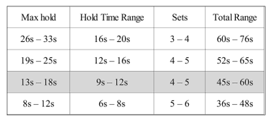

# Overcoming Gravity
## 1 - Laying the Foundation
Changing the lever of an exercise is key to regulating the difficulty of the exercise.
Muscles are strongest at their resting length, the resting length is in the middle between maximum extension and minimum extension. Thus an exercise is harder when the muscle is lengthened or shortened.

In closed chain exercises (where hands or feet are fixed, e.g. pull ups), aka CKC,  we generally can exert more force than in the corresponding open chain exercises (limbs are free to move), aka OKC. CKC Are generally better to train the upper body strength.

CKC bodyweight: better for strength
CKC barbell better for hyperthrophy
OKC good for targetting a specific muscle

## 2 The Basic of the Physiology of Strength
Strength and endurance cannot be optimally developed at the same time, since they require opposite type of training (reps and weight).

Strength takes longer to develop than endurance, but strength also helps in raising the potential maximum for endurance.

Training types:
- strength 1-5 reps (then says 3-8 reps, not clear)
- muscle endurance 12-20 reps
- hypertrophy 4-10 reps (then says 5-12, 5-8 for beginners)

Muscle fiber types:
- type I: endurance, red color
- type IIa: adaptable to both endurance and strength depending on the training regime, pink color
- type IIb: strength, white color, most potential for hypertrophy

Working in the 3-8 reps range is best for strength because it maximizes myofibrillar hypertophy (increase in the muscle powerhouses) and minimizes sarcoplasmic hypertrophy (increase in inactive components of the muscle such as water).

Eccentric (negatives) and isometrics are very taxing on the central nervous system so they should not make up the majority of our program.

## 3 Setting and achieving goals
Setting goals is an integral part of planning trainings, the goals should be specific and measurable. Be sure that your specific goals are useful towards your long term qualitative goal.

Keep a workout log to track what works for you and what doesn't.

## 4 Maintaining structural balance
If you move your center of balance towards the hands it's a **pulling exercise**, if you move it away from the hands it's a **pushing exercise**.

We should keep a balance between horizontal and vertical (body inclination) pushing and pulling.

Elbows should stay close to the body in almost all bodyweight exercises, because it increases the stability.
The shoulder is in a state of flexion when you lift you arms in front of you, while it's in hyperexstension when they are pushed behind you.

Exercise in the same category have more carry over in strength gains.

Structural imbalance leads to poor posture, tightness and possibly injuries. Furthermore we subconsciously limit our power output if the muscles are imbalanced.

The l-sit/v-sit/manna is a very useful progression, because it can balance pushing heavy routine with a simple exercise.

Typically, if rings isometrics are the goal we will end up with some sort of handstand pressing work (pressing upwards), planche work (horizontal pressing), and dipping work (pressing downwards) while there will be some front lever (horizontal pulling), back lever (more vertical oriented pulling), and manna (hybrid press/pull).

## 5 Skill and Progression Charts
Even if our goal is a single skill it's best to keep all of the various skills on a decent level.

Although in competitive gymnastics 2-3 seconds count are sufficient to have achieved a skill, for training purpouses it's better aiming for 6.
For dynamic movements 3 reps are the goal.

Handstand and manna are a must have combo.
Handstand press is another very important exercise.

Handstand pushups, rope climbing and full back lever are very good for developing strength

## 6 The Basic Hierarchy of a Routine
Training routine:
- warmup (until light sweating and light increase in breathing speed)
  - you can use already mastered movements as warmup, you can also use the warmup exercises to maintain progressions that you are not going to train
- skill or technique work (e.g. handstand), once fatigue makes you lose perfect form stop
  - can be integrated in the warmup to save time
- strength
  - eccentric and isometrics first (more intense and more taxing on the Central Nervous System), dynamic movements later (less intense, more volume)
  - full body exercises before isolation ones
  - for beginners go with 2 pulling and 2 pushing exercises, both flexion-in-flexion (handstand, pushup, planche, dip) and flexion-in-extension (pullups, front lever, back lever, inverted pullups) Good legs exercises are pistol squats, plyometrics and sprinting
- endurance
- flexibility
  - German hangs, wall slides and band dislocates are very good shoulder mobility exercises

## 7 Structuring the Routine
Full body workouts allow for much greater frequency in the exercises that we want to master. Typically isolation work is useful for injuries or elite athletes.

Choose 1/2 goals in each of these areas:
- skill
- strength
  - pushing
  - pulling
  - legs
- mobility

Then for each area you should have 2/3 exercises

Do first the exercises aiming for the goal you want to achieve the most.

## 8 Programming
As our body adapts to the stimulus of our training we must increase the stimulus to continue improving.

Generally the optimal recovery time is 2-3 days.

Neurological adaptation are the ones that need the most stimulus, muscle build up is easier to achieve. This neurological component is very important in the power output (that's why relatively small athlethes can exert great strength).

We must consider the weekly volume and not the volume of the single workout.

Deload weeks are very important.

microcycle: 1 week
mesocycle: 4-8 microcycles
macrocycle: various mesocycles

### concentric
We will inted concentric exercises as having a controlled eccentric followed by an explosive concentric.

To adjust the stimulus of the training it's easier to increase volume than intensity until you can jump to the next progression.

We are mainly going to use the 3-8 reps range (sweet spot 5 reps) aiming for a total of 25-50 total reps per exercise goal, thus we will perform 2-3 exercises (2 is best for beginners). Try to stop 1-2 repetitons short of technical failure.

### isometrics

2s of isometric hold are equivalent to 1 concentric rep.

### eccentric
Eccentric stimulate our body harder and fatigue faster.

### Rest times per set and intra workout structure
For strength gains it's better not to go below the 3 minutes rest between sets.

To optimize time we can pair exercises, one way is pairing opposing muscles (a good combo is planche and front lever) in this case we can halve the rest time.

### General strength and isometrics
Isometric exercise increase strength only in a small range of motion around the position trained (~30 degrees) so in this sense they are to be used sparingly.
front lever replaced by front lever pullups, planche by planche push up.

Still isometric skill will progress faster through isometric work, so if that's the goal they are to be used.

Hypertrophy is best achieved through varying the exercises, while strength needs repeated compound work.

A good mix is working isometrics for 2-3 mesocycles and avoiding them for 1.

### Routines and grease the groove
Routines are good because they train also the transition movements, useful for intermediate and advanced trainees.

Grease the groove consists in doing 6-10 submaximal sets spread throughout the day, this leads to greater volume. Good for quickly achieving a lot of max reps in particular in pushing concentrics, works well also with the front and back lever, doesn't work with the planche.

### Core work
The author suggests integrating the core work in the flexibility and skill work. 
Example routine:

If you do not implement weighted exercise for the legs that provides good lower back training some good replacements are: gluteham raises and reverse hyperextensions.

As a novice you should almost never skip a workout or cutting it short unless the quality of the exercise is really low, as an advanced trainee you may choose to do so depending on your fatigue.

## 9 Programming and Advancing
### Intra-mesocycle factors
#### Novice
If you are a novice you have the ability to do linear progression in your strength. For concentrics if you reach 3x8-10 you should go to the next progression if you can do 3-4 quality repetitions.
3 days a week is a good schedule.

To test your isometric proficiency you can schedule a test on the second day of rest or on the first training of the week.

You generally can go to the next isometric progression if you have 25-30 secs hold.

You should also be able to raise the progression or the reps almost every workout.

If for an entire week you don't increase reps or progression then you hit a plateau and you should end the mesocycle.

#### Intermediate level
Avoid the paralysis by analysis: planning at this level should'nt be overly complex.

Splitting your workouts (as opposed to full body trainings) can be beneficial for trainees that also practice other sports.

Eccentrics start to be more useful.
Your flexibility should be on the level that your chest touches your knees both in pike and straddle position.

## Stretching
Studies have shown that 30-40s for about 3-5 sets is optimal for stretching.

Full range of motion exercises are more effective than static stretching.

### Hips
The pike and straddle stretch are good options. Remember to work also on active compression.

You can work on your core while stretching the hips, in particular performing active compression.

### Back
Good options are the bridge and its progressions, the seal stretch and the side seal.

### Shoulder
Refer to page 209 for a serie of good exercises.

### Wrists
Good exercises are wrist pushups and seated stretches.